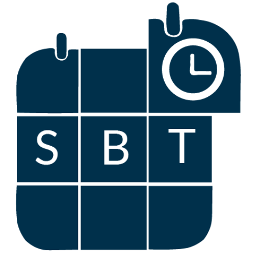
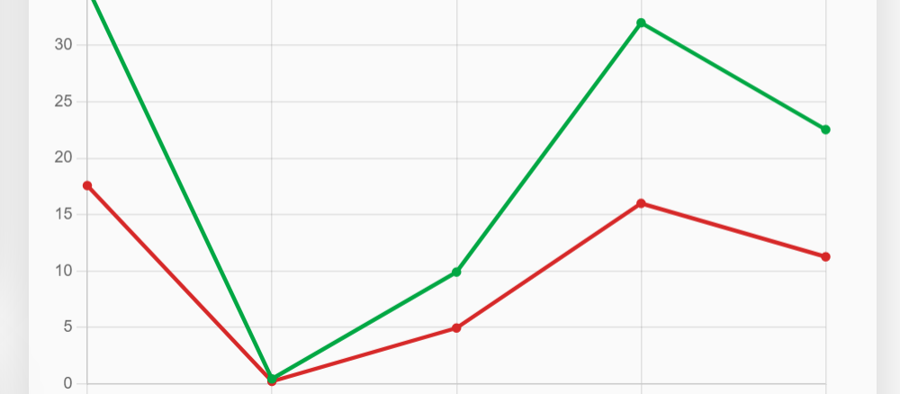
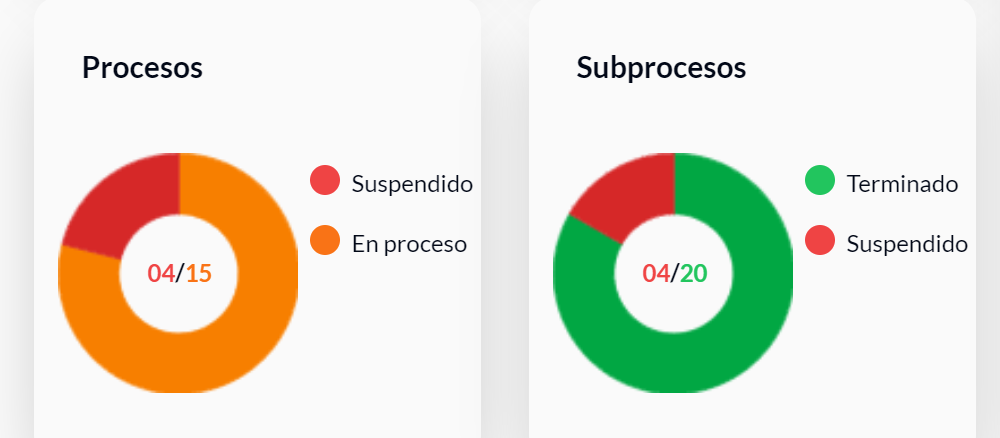

# s13-11-m-java

## :computer: Project Synopsis

We give you a short introduction to what our project does:

### Welcome to the Smart Businees Tracker!

The [**Smart Businees Tracker**](https://s13-11-m-java.vercel.app/). is your ally in efficiently managing your company's work processes. With this innovative tool, you can optimize the planning, tracking, and analysis of your projects in an intuitive and effective way. 

With key features such as automatic feedback of real production data, you can have a clear view of your performance compared to the established objectives. Easily record the production carried out in each process, which will provide valuable information for making informed decisions.

### Do you need to adjust the processing times?

No problem! With the ability to modify estimated times based on experience and changing conditions, you will be able to plan more accurately and adapt quickly to the project's needs.

In addition, with the option to add notes and clarifications, you will be able to effectively communicate any relevant information to your production team. From problems encountered to ideas for improvement, everything can be easily documented for a more seamless collaboration.

Visualize your data clearly and concisely through interactive graphics, allowing you to identify areas of opportunity and optimization in your processes. With the integration of work schedules and holidays, as well as additional options such as overtime, vacations, and leaves, the Smart Calendar adapts to the specific needs of your company.

Simplify the management of your projects and take your production to the next level with the Smart Calendar!

 

  
  
  
  
<!--   
   -->

 

## :computer: Team

List of participants in this project, contact and roles in which they performed the most.

| Count | Name                                                                                   |    linkedin.com/in/ | :octocat:| Github   Nickname| Role   (Only this project) |
| --- |--- | --- | --- | --- | ---: |
| 1 | Milagros Cifres  | <!-- [****](https://www.linkedin.com/in//) -->                                         |  | [**milagroscifre**](https://github.com/milagroscifre) | 🎨 UX/UI |
| 2 | Giuliana Tregnaghi | [**giuliana-tregnaghi/**](https://www.linkedin.com/in/giuliana-tregnaghi/)             |  | [**Giulianatregnaghi**](https://github.com/Giulianatregnaghi) | 🎨 UX/UI |
| 3 | Claudia Coronel | [**coronelclaudiaalicia/**](https://www.linkedin.com/in/coronelclaudiaalicia)          |  | [**manara2021**](https://github.com/manara2021) | Tester |
| 4 | Pedro Villasboa | <!-- [****](https://www.linkedin.com/in//) --> |  | [**pedrovillasboa**](https://github.com/pedrovillasboa) | Tester |
| 5 | Camila Cancino | <!-- [****](https://www.linkedin.com/in//) --> |  | [**camcancino**](https://github.com/camcancino) | Tester |
| 6 | Gabriela Pardo | [**gabriela-beatriz-pardo/**](https://www.linkedin.com/in/gabriela-beatriz-pardo/)     |  | [**GBPardoGabrielaBeatriz**](https://github.com/GBPardoGabrielaBeatriz)| Tester |
| 7 | Andrés Segura | [**andresseguradev/**](https://www.linkedin.com/in/andresseguradev/)                   |  | [**Andr7st**](https://github.com/Andr7st) | FullStack |
| 8 | Agustín Javier Lucentini | [**agustinlucentini/**](https://www.linkedin.com/in/agustinlucentini/)                 |  | [**lucenstuff**](https://github.com/lucenstuff) | FullStack |
| 9 | Santiago Ariel | [**santiagoarielv/**](https://www.linkedin.com/in/santiagoarielv/) |  | [**santiagoarielv98**](https://github.com/santiagoarielv98) | FrontEnd | 
| 10 | Fernando Ariel Muzaber | [**fermuzadev/**](https://www.linkedin.com/in/fermuzadev/) |  | [**fermuzadev**](https://github.com/fermuzadev) | FrontEnd |
| 11 | Joaquin Acosta | [**joaquinhdev/**](https://www.linkedin.com/in/joaquinhdev/) |  | [**JoaquinHAcosta**](https://github.com/JoaquinHAcosta) | FrontEnd |
| 12 | Juan Pablo Godoy | [**godoypablojuan/**](https://www.linkedin.com/in/godoypablojuan/) |  | [**DocisJP**](https://github.com/DocisJP) | Backend |
| 13 | Nestor Duque | [**nestorduqueduque/**](https://www.linkedin.com/in/nestorduqueduque/)                 |  | [**nestorduqueduque**](https://github.com/nestorduqueduque) | Backend |
| 14 | Leon Asturizaga | [**leon-asturizaga-94a80377/**](https://www.linkedin.com/in/leon-asturizaga-94a80377/) |  | [**leonasturizaga**](https://github.com/leonasturizaga) | Backend |
| 15 | Gabriel Remes | [**gabriel-mayantz-remes/**](https://www.linkedin.com/in/gabriel-mayantz-remes) |  | [**Gabusy07**](https://github.com/Gabusy07) | Backend |
| 16 | Karen Diaz | |  | [**karennn332**](https://github.com/karennn332) | Backend |
| 17 | Lucas Von Elm | |  | [**xlucasve**](https://github.com/xlucasve) | Backend |

 

## :computer: Tech Stack 

Tools for this project.

 * **Project type:** `SAAS`
 * **QA:** `jira`.
 * **UX/UI:**  `figma`.
 * **Database:** `postgresql`.
 * **Backend:** `java` `spring boot` `jpa` `maven` `docker` `deploy-platform: aws`.
 * **Frontend:** `react` `typescript` `vite` `tailwindcss` `redux` `deploy-platform: vercel`.
 * **Testing** `postman` `swagger`.

 

## :computer: QA Documentation
[https://drive.google.com/drive/folders/1V9Kb8z5FKeiK13v2ye-82vTDM0Q3voFO?usp=drive_link]

 
## :computer: Thanks

[**No Country**](https://www.nocountry.tech/)

  

