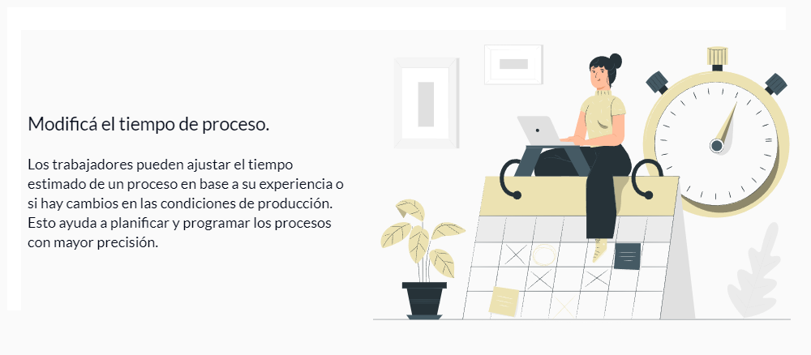
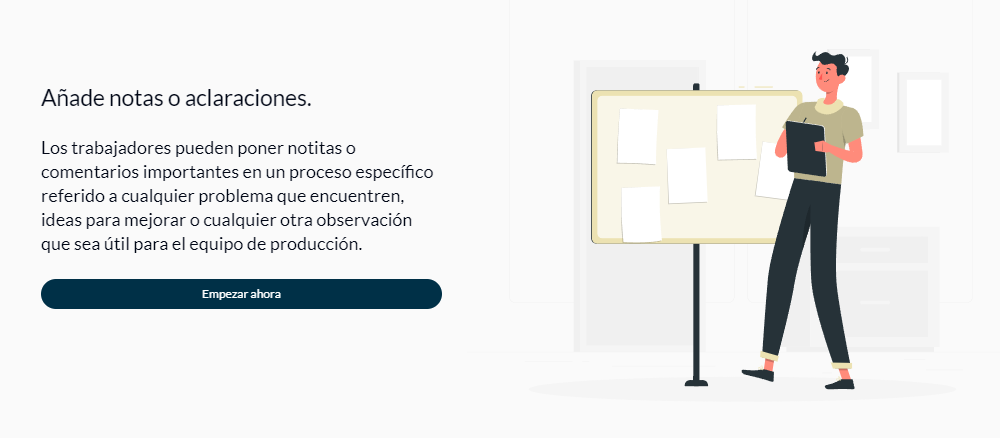

# s13-11-m-java
[comment]: <> ( Breve descripción del proyecto. )
[comment]: <> ( Una aplicación que ayuda a gestionar procesos de trabajo SAAS. )

## Contenido

 - [Sinopsis del proyecto](#sinopsis-del-proyecto)
 - [Stack](#stack) 
 - [Integrantes](./CONTRIBUTING.md) 

 

## Sinopsis del proyecto

### ¡Te damos la bienvenida al Calendario Inteligente!

El Calendario Inteligente es tu aliado en la gestión eficiente de los procesos de trabajo de tu empresa. Con esta herramienta innovadora, podrás optimizar la planificación, seguimiento y análisis de tus proyectos de manera intuitiva y efectiva.

Con características clave como la retroalimentación automática de datos de producción real, podrás tener una visión clara de tu rendimiento en comparación con los objetivos establecidos. Registra fácilmente la producción realizada en cada proceso, lo que te brindará información valiosa para tomar decisiones informadas.

  

### ¿Necesitas ajustar los tiempos de proceso? 
¡No hay problema! Con la capacidad de modificar los tiempos estimados en función de la experiencia y las condiciones cambiantes, podrás planificar con mayor precisión y adaptarte rápidamente a las necesidades del proyecto.

Además, con la opción de agregar notas y aclaraciones, podrás comunicar de manera efectiva cualquier información relevante para tu equipo de producción. Desde problemas encontrados hasta ideas para mejorar, todo se puede documentar fácilmente para una colaboración más fluida.

  

Visualiza tus datos de manera clara y concisa a través de gráficos interactivos, que te permiten identificar áreas de oportunidad y optimización en tus procesos. Con la integración de horarios de trabajo y feriados, así como opciones adicionales como horas extras, vacaciones y licencias, el Calendario Inteligente se adapta a las necesidades específicas de tu empresa.

  

¡Simplifica la gestión de tus proyectos y lleva tu producción al siguiente nivel con el Calendario Inteligente!

Project deploy: [**s13-11-m-java.vercel.app/**](https://s13-11-m-java.vercel.app/).

---

## Stack 

El lenguaje o tecnología base para el desarrollo de este proyecto es java. Categoría del proyecto `SAAS`.

 * **QA:** `jira`.
 * **UX/UI:**  `figma`.
 * **Database:** `postgresql`.
 * **Backend:** `java` `spring boot` `jpa` `maven` `docker` `deploy-platform: aws`.
 * **Frontend:** `react` `typescript` `vite` `tailwindcss` `redux` `deploy-platform: vercel`.
 * **Testing** `postman` `swagger`.

 

